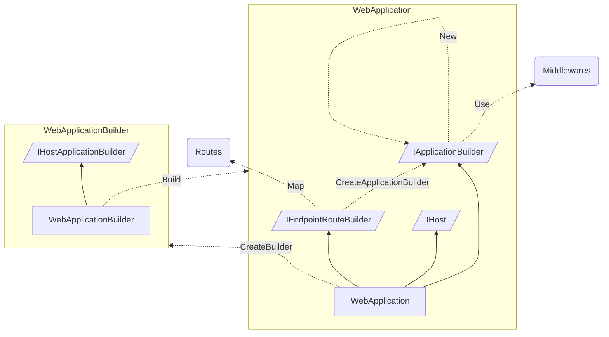
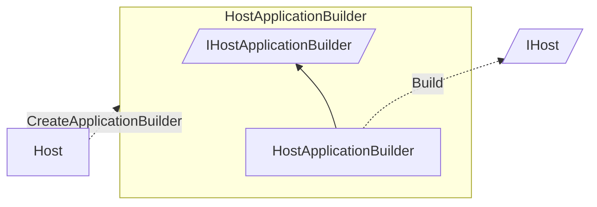

# Memo

## WebApplication and WebApplicationBuilder

```mermaid
flowchart BT
  subgraph WebApplication
    IAppBuilder[/IApplicationBuilder/]
    IEpBuilder[/IEndpointRouteBuilder/]
    IHost[/IHost/]
    webApp[WebApplication]

    webApp --> IAppBuilder
    webApp --> IEpBuilder
    webApp --> IHost
  end

  IAppBuilder .-> |Use| Middlewares(Middlewares)
  IEpBuilder .-> |Map| Routes(Routes)

  IAppBuilder .-> |New| IAppBuilder
  IEpBuilder .-> |CreateApplicationBuilder| IAppBuilder

  subgraph WebApplicationBuilder
    webAppBuilder[WebApplicationBuilder]
    IHostAppBuilder[/IHostApplicationBuilder/]

    webAppBuilder --> IHostAppBuilder
  end

  webAppBuilder .-> |Build| WebApplication
  webApp .-> |CreateBuilder| WebApplicationBuilder
```

## Generic host application (in IHost) and HostApplicationBuilder

```mermaid
flowchart BT
  subgraph HostApplicationBuilder
    IAppBuilder[/IHostApplicationBuilder/]
    appBuilder[HostApplicationBuilder]

    appBuilder --> IAppBuilder
  end

  appBuilder .-> |Build| IHost[/IHost/]

  host[Host] .-> |CreateApplicationBuilder| HostApplicationBuilder

```